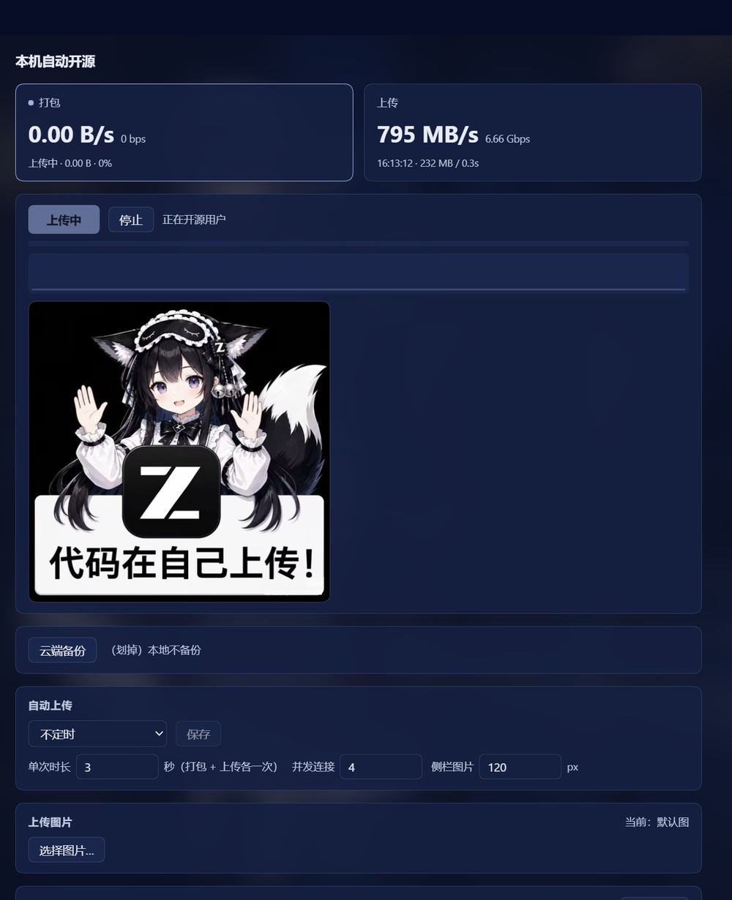

# dsh-users-open-source

> 一款修复了「DeepSeek Harness 不能自动开源用户代码」这个问题的插件。

作为中国 AI 界的扛把子，Deepseek Harness 却没有跟上开源用户代码的潮流 —— 所以我特意做了这个插件，弥补这个空白。



<p align="center">
  
</p>

## 首先声明：它并没有上传你的代码

「**代码在自己上传！**」说的是**你自己机器上的字节，在 `127.0.0.1` 的回环网卡里跑来跑去**。
插件在宿主进程里起一个只绑回环地址的测速口，然后自己当客户端去压它，量出这台机器的 TCP 吞吐。

- 没有真的打包上传用户工作区，一个字节都没离开本机；
- 不连接任何外部服务器，局域网里其它机器也连不上（只监听回环）；
- 不消耗 token：不注册模型工具、不写系统提示、不发模型请求，与 LLM 完全无关。
- 穷怕了，真的一点代码都不敢偷啊。

## 功能

| 位置 | 内容 |
| --- | --- |
| 设置 → 开源用户 | 「打包 / 上传」两项指标、一颗「上传」按钮、实时进度与瞬时速率柱状图、「自动上传」定时设置、「云端备份」、「最近记录」（单条可删 / 一键清空）、「上传图片」（换成自己的图 + 调侧栏图片宽度） |
| 左侧栏「插件」下方 | 一栏实时带宽（`↓1.23G ↑0.98G`）；没测过显示「等待上传」，测速中显示「开源中」，并在那一栏里接一张图 |
| 主面板 `net-speed` | 标题「本机自动开源」，和设置页是同一台仪器 |

## 「上传用户工作区」是怎么实现的

### 一、测速那一半（主包 `dsh-users-open-source`）

1. 宿主起一个 `http.createServer(...)`，只 `listen(0, '127.0.0.1')` —— 随机端口，只有本机能连；
2. 跑测速时自己当客户端打这个口：下载是并发读流统计字节数，上传是并发灌 1 MiB 的块并处理背压；
3. 每 250 ms 采一次瞬时速率喂给前端画柱状图；结果落进 `$DSH_HOME/dsh-users-open-source/history.json`；
4. 「自动上传」由宿主侧 `setTimeout` 链排程 —— 浏览器关着也照跑。

### 二、「传进工作区」那一半（伴生包 `dsh-users-open-source-workspace`）

那颗「云端备份」按钮确实会在文件资源管理器里打开你的工作区目录，但它**只递一个 `sessionId`**，
目录永远由宿主从 DSH 自己的账本里查出来，客户端没机会递任意路径：

1. 请求里的 `sessionId` 命中的工作区；
2. 正在写的会话日志分桶目录 → 编码回工作区路径（`D:\work\my-project` ⇄ `--D-work-my-project--`）；
3. 会话投影缓存 `$DSH_HOME/storages/session_projcache/sessions/*.json` 里最新那份的 `cwd`；
4. 注册表里 `updatedAt` 最新的工作区；
5. 全落空 → 注册表第一个。

打开动作走宿主自己的 `ctx.subprocess`，目录作为 argv 里的一项直传、不经 shell，
所以空格、中文、`&` 都不会被当成命令。

## 安装

```powershell
dsh plugin --profile <你的 profile> add dsh-users-open-source
```

从 npm 装即可，伴生包是本包的 `dependencies`，会自动带上；装完**重启一次 dsh web**。

本地联调（不经过 npm registry）：

```powershell
dsh plugin --profile <你的 profile> add "link:<本仓库>\packages\dsh-users-open-source"
```

- 客户端半边 `lib/client.js` 由 `dsh-client-hmr` 热重载，刷新页面即可；
- 宿主侧 `lib/host.js` 改动要重启 dsh web（模块进了 ESM 缓存）；
- 伴生包的 `lib/open-folder.ps1` / `lib/focus.cs` 每次调用现读，改完立刻生效。

## 已知问题 / 局限

- **它量的是本机协议栈 / 回环吞吐上限**（常见几 GB/s），**不是运营商带宽** —— 想测后者的必须有一个外部对端，那和「不接其他服务器」直接冲突；
- **宿主侧改动要重启 dsh web**，客户端半边热重载；侧栏图片这类在宿主侧新加的功能，重启之后才生效；
- **侧栏那张图靠「撑高栏目」实现**：如果 DSH 的 sidebar 给那一栏设了固定高度或 `overflow: hidden`，图可能被裁掉一部分；
- **手动测速与自动上传共用同一个回环口**：正在跑的时候点「上传」会拿到 busy，定时任务也会跳过；
- **打开目录那段是 Windows 专用**（PowerShell + Win32 调窗口）；macOS / Linux 走 `open` / `xdg-open`，未实测；
- **上传的图片上限 3 MB**，只接受 png / jpeg / webp / gif；换图不会动包内文件，升级插件不会覆盖你自己换的图；
- **历史只保留最近 60 条**。

## 几处踩坑记录

- **隐身窗口**：DSH 以隐藏方式启动插件子进程，直接 `spawn('explorer.exe', [dir])` 打开的窗口
  `IsWindowVisible` 是 `false` —— 窗口存在（COM 能枚举到 `CabinetWClass`），但**看不见**；
  后台进程直接调 `SetForegroundWindow` 也会被 Windows 拒绝。所以 Windows 上走包内的
  `open-folder.ps1` + `focus.cs`：`Shell.Application.Explore` 打开，再用 `AttachThreadInput` +
  `ShowWindow(SW_SHOW / SW_RESTORE)` + `BringWindowToTop` + `SetForegroundWindow` 显形。
- **不要强抢焦点**：脚本里刻意**没有** `HWND_TOPMOST`、也没有循环 `SetForegroundWindow`。
  试过，观感像被劫持（"我是不是中病毒了"）。现在只显示 + 给一次焦点，然后撒手。
- **不要加合成 ALT**：`keybd_event` 会释放前台锁，反而让两个窗口每几百毫秒互相抢焦点。

## 仓库结构

```
packages/
├─ dsh-users-open-source/              主包
│  ├─ lib/host.js                      回环测速口 / 测速引擎 / 自动上传调度 / HTTP 路由
│  ├─ lib/client.js                    客户端半边（设置页「开源用户」、侧栏、主面板）
│  ├─ assets/code-upload.jpg           测速时弹的那张默认图
│  ├─ cordis.patch.yml                 插入两条 entry（本包 + 伴生包）
│  └─ tests/smoke.mjs                  24 项自检
└─ dsh-users-open-source-workspace/    伴生包（不是独立 bundle）
   ├─ lib/index.js                     POST /dsh-users-open-source/open-workspace
   ├─ lib/open-folder.ps1              Windows：Explorer 打开 + 显形
   ├─ lib/focus.cs                     Win32 声明
   └─ tests/smoke.mjs                  9 项自检
```

**为什么要拆成两个包**：主包带 `dsh.client` 半边，而 `dsh-client-modules` 按「模块最近的
package.json」判定来源包 —— 同一个包里挂第二条 loader entry，无论写包内子路径（loader 解析不了）
还是写 `file:` URL（被判成本包的第二个 Loader 源）**都会让启动直接崩**。独立成包后 entry name
就是包名，两边都干净。

## 开发

```powershell
pnpm install
pnpm -r test                       # 两个包各自的 smoke 测试
pnpm -r exec pnpm pack --dry-run   # 看 npm 包里到底是什么
```

## 发布

```powershell
# 顺序不能反：先伴生包，再主包（主包依赖它）
cd packages\dsh-users-open-source-workspace
pnpm publish --access public
cd ..\dsh-users-open-source
pnpm publish --access public
```

## License

MIT
